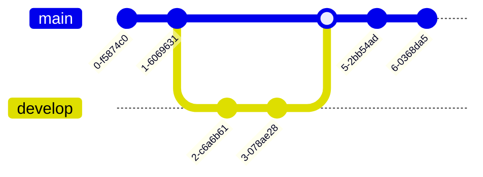
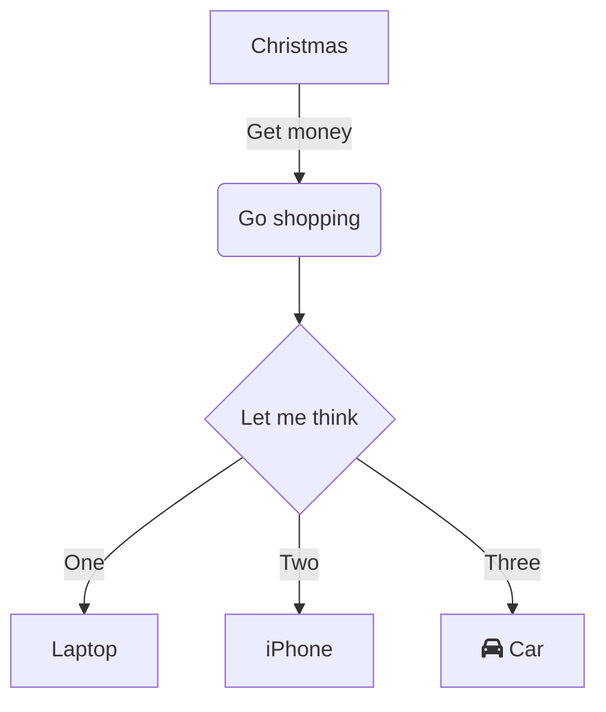
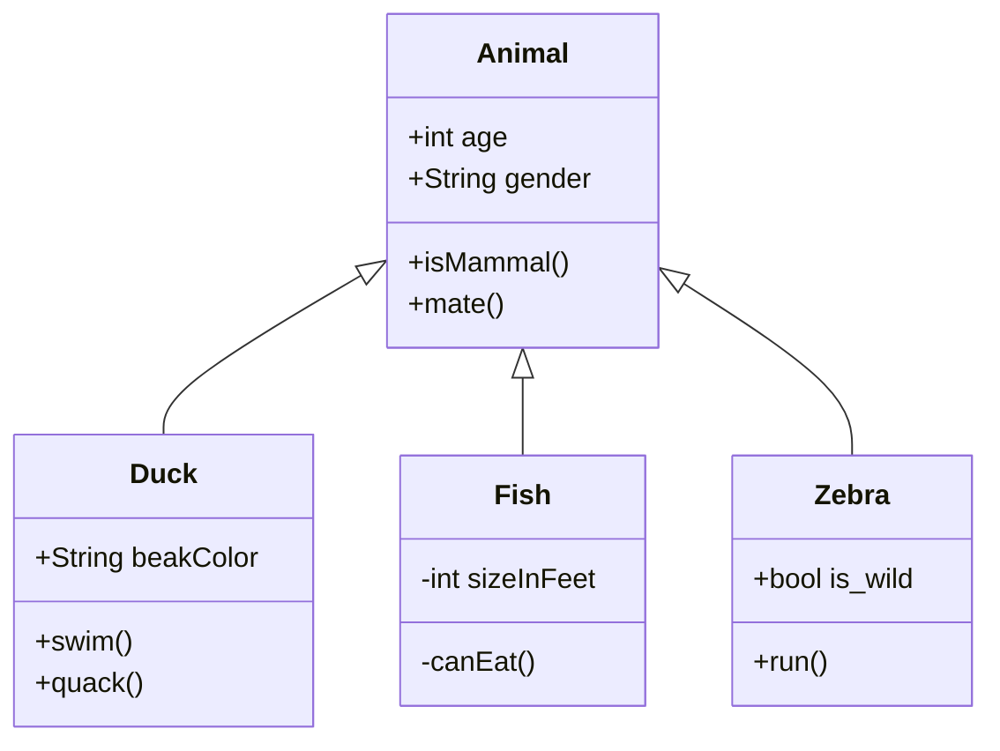
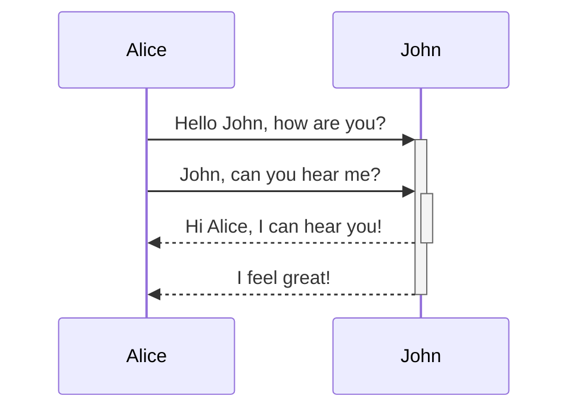
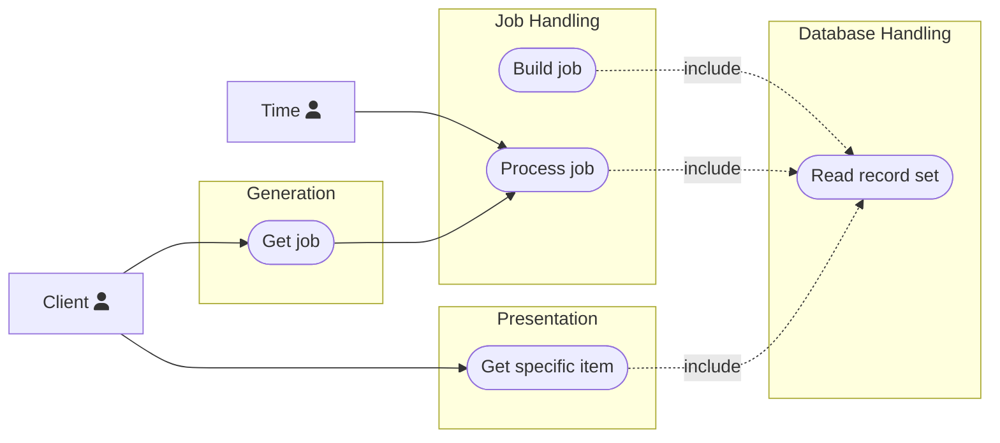
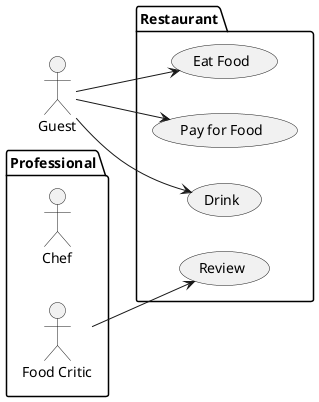

# Project Template

[](https://doi.org/10.5281/zenodo.15603427)
[](https://creativecommons.org/licenses/by-nc-sa/4.0/)

The following is a one-page basic software project template. The template gives
an outline for a minimal structure for a generic software project. Each section
of the template has a description. Sections can be added, removed, or altered as
needed to fit the software being built.

## Note to Reader

If you discover an issue with this repository or have a question, please feel
free to open an issue. I've included templates for the following issues:

-   🐞 Spelling and Grammar
-   🤷 Clarity
-   ❓ Question
-   🚀 Enhancement

## Release Tagging

The repository adopts [semantic versioning](https://semver.org) for version
labels.

```
vMAJOR.MINOR.PATCH
```

## Cite Me 📃

BibTeX and APA on the right sidebar of GitHub.

<!-- prettier-ignore-start -->
## Citations
1. Pressman, R. S. (2015). Software engineering: A practitioner's approach (Eighth edition). McGraw-Hill Education.

## License ⚖️
<p xmlns:cc="http://creativecommons.org/ns#" xmlns:dct="http://purl.org/dc/terms/"><span property="dct:title">Materials for a Course on Teaching Undergraduate Research</span> by <span property="cc:attributionName">Joseph Starr and Lori Adams</span> is licensed under <a href="https://creativecommons.org/licenses/by-nc-sa/4.0/?ref=chooser-v1" target="_blank" rel="license noopener noreferrer" style="display:inline-block;">CC BY-NC-SA 4.0</a></p>

<!-- prettier-ignore-end -->

## Resources

### Links 🔗

Some useful resources:

-   [Software engineering : a practitioner's approach by Roger Pressman](https://search.lib.uiowa.edu/permalink/f/9i2ftm/01IOWA_ALMA21322763270002771)
-   [diagrams.net](https://app.diagrams.net/)
-   [mermaid.js](https://mermaid.js.org/config/Tutorials.html)
-   [plantUML](https://plantuml.com/)
-   [Semantic versioning](https://semver.org) for version labels.
-   [Conventional Commits](https://www.conventionalcommits.org/en/v1.0.0/)
-   [Architectural Decision Records](https://adr.github.io)
-   [Markdown Architectural Decision Records](https://adr.github.io/madr/)
-   [git book](https://git-scm.com/book/en/v2)
-   [COLORS](https://clrs.cc)

---

### Mermaid examples 🧜

<link
  href="https://cdnjs.cloudflare.com/ajax/libs/font-awesome/6.5.1/css/all.min.css"
  rel="stylesheet"
/>

#### Git Graph



#### State Machine



#### Class Diagram



#### Sequence Diagram



#### Use Case Diagram



---

---

---

---

### PlantUML Example 🌱

#### Use Case Diagram



---

# A One-Page Project Doc

_One paragraph project description. This should describe the goal you're trying
to accomplish._

# Planning

## License

_Select a [License](https://choosealicense.com/) for the project. Write a
sentence why you selected the license. Copy the respective "LICENSE" file from
GitHub into the root of the repo._

## Tasks

_Describe how work is partitioned and distributed._

## Version control

_Describe a version control strategy. Will you branch? Will you rebase? How many
branches will you maintain? How will versions be labeled?_

## Project Structure

_Describe the file/directory structure of the project_

-   **No directory or file shall contain:' ' or a capital letter.**
-   **Source: contains all source code for the project. Each unit in a unique
    directory**
-   **Test: contains all the test code for the project.**
    -   **test/unit_test: contains all the unit test code for the project. Each
        unit in a unique directory**
    -   **test/integration_test: contains all the integration test code for the
        project. Each test in a unique directory.**

## Define a unit

_What is a unit for this project? A function? A class? Something else?_

## Quality

_Describe the quality goals for the project. Is this a prototype? Is this a
product?_

### Unit testing

_Describe the unit testing strategy for this project._

### Integration testing

_Describe the integration testing strategy for this project._

## Requirements

### Functional Requirements

_Functional requirements for a simple project should be phrased as use cases.
Example can be found in docs._

**Note that mermaid doesn't support use case diagrams, you need to use another
tool(draw.io, plantUML) until
[this issue](https://GitHub.com/mermaid-js/mermaid/issues/4628) is resolved.**

### Non-Functional Requirements

_Non-functional requirements should be listed._

_Ex:_

-   _Needs to run on the cluster._
-   _Needs to run on windows._
-   _Can't spend money on tools._

## Technologies

### Languages/Frameworks

_Describe what languages/Frameworks will be used in the project. Include links
to the languages/Frameworks and setup instructions. Include the reasons you're
picking the languages/Frameworks (it's absolutely fine to pick a language
because you already know how to work with it)._

#### Style Guide

_Pick a style guide from the internet that includes a formatter, link that here
and use it._

### Tools

_Describe tools (IDE, Debugger, build tools, test framework) you'll use in the
project. At a minimum, this should include your version control tooling._

# Design and Documentation

**This is the most important section of the document. People discuss
documentation as only well commented code. While well commented code is
important, having diagrams and real English descriptions for what you're trying
to do is much more important!**

## System

_A block diagram for the entire system._

## Units

_A collection of units for the project._

### Unit: Title

#### Description

_Describe the point of the unit_

#### Diagrams

_Include some diagrammatic description of the unit. A class diagram? A sequence
diagram? A state machine?_

#### Unit test description

_List of the unit tests for this unit._

$\cdot$

$\cdot$

$\cdot$

### Unit n: Title

#### Description

_Describe what this unit is trying to accomplish._

#### Diagrams

_Include some diagrammatic description of the unit. A class diagram? A sequence
diagram? A state machine?_

#### Unit test description

_List of the unit tests for this unit._

# Integration tests

_List of the integration tests for the system._
